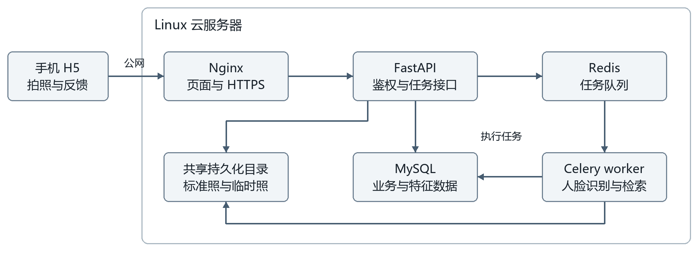

# 云端人脸签到系统简要设计文档

## 一 项目目标与范围

本项目拟实现面向课程和班级的云端人脸签到系统。管理员为一次课程选择班级并设置签到起止时间，学生打开该场次的手机页面，无需登录即可拍照签到。服务器识别人脸、核对场次名单和时间窗口后保存记录并反馈结果。系统采用 H5、FastAPI、MySQL 和独立识别 worker，支持注册录入、登录、退出登录、照片库管理、场次管理和签到记录查询。

### 小组成员

| 学号 | 姓名 |
| --- | --- |
| 241098131 | 李承垚 |
| 241051006 | 陈泽昊 |
| 241051011 | 何翌闻 |
| 241276025 | 陈旭枫 |

### 功能与权限

| 身份 | 可执行操作 | 访问边界 |
| --- | --- | --- |
| 未登录访客 | 注册、登录、打开场次页面、拍照签到、查询本次任务结果 | 只提交场次标识和照片，不读取名单、照片库及历史记录 |
| 普通用户 | 退出登录、维护本人标准照、查看本人签到记录 | 服务器校验资源所属用户 |
| 管理员 | 管理照片库、创建班级签到场次、查看场次名单与签到统计 | 部署初始化创建，公开注册只能创建普通用户 |

注册填写姓名、学号和密码，从已有班级中选择所属班级，并上传标准人脸照片；班级由管理员维护。注册成功必须同时满足账户创建和可用人脸录入成功，同一学号不能重复注册。“注销”在本版中指退出登录，不删除账户。

每次课程创建独立签到场次，填写课程或场次名称、目标班级、开始时间和结束时间。同一人员在同一场次最多签到成功一次，重复提交返回“本场次已签到”；同一天的不同场次分别记账。签到身份只由服务器人脸检索确定，与设备、登录账号及客户端传入的人员编号无关。

管理员可查看该场次应到、已签到和未签到人员。未录入人员及非名单成员不得签到；系统仅在场次有效时间内接收新签到请求，已接收的任务可在截止后完成。场次名单以创建时该班级已注册且有效的人员为准，创建后不随转班或新注册自动变化。

首次提交说明设计与实施计划；模型准确率、处理时延和并发容量通过后续实测获得。三周内优先完成完整功能与并发验证，活体检测、多机部署和独立向量数据库不列入本版范围。

## 二 总体架构与技术选型

图 1 手机通过公网访问云服务器，识别任务交由 worker 执行。MySQL 保存业务数据，Redis 传递任务；API 与 worker 共享照片目录。

| 层次 | 技术选择 | 主要职责 |
| --- | --- | --- |
| 手机端 | HTML、CSS、JavaScript | 场次入口、拍照上传、任务进度与结果展示 |
| 接入与接口 | Nginx、FastAPI、Uvicorn | 页面与接口同源访问、鉴权、校验、查询 |
| 数据访问 | SQLAlchemy、PyMySQL | MySQL 连接池、事务及持久化操作 |
| 数据库 | MySQL 8.4 LTS | 账户、班级、场次名单、人脸特征、任务与签到记录 |
| 图片与模型 | OpenCV、InsightFace、ONNX Runtime CPU | 解码、检测、对齐、编码与模型推理 |
| 人脸检索 | NumPy | 内存中精确计算归一化特征的相似度 |
| 任务处理 | Redis、Celery | 消息传递、受控 worker 执行及有限重试 |
| 部署与存储 | Linux、Docker Compose、持久化数据卷 | 同机运行服务，保存数据库与照片文件 |

云服务器以公网 IP 提供页面和接口入口，数据库、Redis 和 worker 仅在内部网络通信。采用可信 HTTPS 传输；通过 IP 使用 HTTPS 时，证书需包含该 IP 且被手机信任。若使用域名证书，仍保留公网 IP 访问验证路径。实际地址、证书及端口配置在部署阶段落实。

手机端首选文件控件拍照上传，并在演示手机上实测兼容性；网页内实时相机预览仅在安全上下文中启用。[1] Celery 在 Linux 容器或 WSL2 中开发与验证，云端同样使用 Linux。[2] 依赖版本在首轮模型试跑后锁定。

## 三 人脸识别与业务流程

### 模型与检索方法

使用预训练模型完成推理。首个基线为 InsightFace 的 buffalo_l：SCRFD 检测人脸及关键点，基于关键点对齐人脸，识别网络提取特征。ArcFace 是人脸识别训练方法，不代表唯一网络结构。仅加载检测和识别所需模块，采用 CPU ONNX Runtime；如实测耗时不满足演示目标，再评估轻量模型包。[3][4]

对特征向量进行 L2 归一化后，使用点积计算余弦相似度。同一人员有多张有效标准照时，取该人员各标准照中的最高相似度，再按人员排序；最高分须达到阈值，且与次高人员分数足够区分，否则拒绝确认身份。相似度阈值和分差使用已录入人员的新照片及真正未录入人员照片调试，并用另一组照片验收。

### 注册与标准照录入

手机提交基本信息、密码和标准照 → API 校验字段与图片，将密码哈希后创建待激活账户及任务 → worker 检测唯一清晰人脸、对齐并编码 → 在事务中保存有效人脸特征、激活账户、增加特征库版本并完成任务 → 手机显示注册成功。识别失败时账户保持不可登录、不可参与匹配，显示重拍原因；失败或过期的待激活资料按清理规则回收，允许重新注册。

### 创建课程签到场次

完成本班人员注册录入后，管理员登录并填写课程或场次名称，选择一个班级及起止时间。服务器验证开始时间早于结束时间，在事务中创建场次及应到名单快照，生成随机场次码和手机访问链接。发布后名单、班级与起止时间固定，管理员可提前结束场次；未开始、进行中、已结束状态按服务器时间和提前结束时间判定。

### 无需登录的场次签到

手机打开指定场次链接并上传照片 → API 校验场次时间窗口，完整接收及校验上传后记录 received_at 并创建任务 → worker 检测、对齐、编码，在全体有效人脸中做 1:N 检索 → 识别成功后核对该人员是否属于场次名单 → 事务写入该场次记录并完成任务 → 手机显示签到成功或本场次已签到。未识别到已录入人员、身份不明确、非本场次人员和处理失败分别反馈，不新增成功记录。

时间资格按服务器 received_at 判断，须满足开始时间 ≤ received_at < 有效结束时间；提前结束时取原结束时间与关闭时间的较早者。有效时间内接收的任务允许在截止后完成识别，排队不导致误判迟到；客户端拍摄时间不作为依据。写入时重新校验人员状态、名单及有效时间，已超时失败的任务不得继续写成功记录。

### 照片库维护与一致性

新增或替换照片需完成校验和编码后才生效；替换失败保留原有效照片。MySQL 维护特征库版本，worker 每次任务前检查版本并在变化时刷新本地缓存。最终校验与签到写入在同一事务中锁定人员和版本记录；版本不一致则退出事务，重新加载并匹配。删除人脸时同步更新状态与版本，避免旧缓存继续签到。最后一张有效照片被删除后，该人员无法签到，但既有签到记录保留。

标准照和特征使用同一模型与预处理版本；更换模型时统一重建有效特征。人脸相似度不能证明活体，本版不承诺识别打印照片或屏幕翻拍等代签行为。

## 四 接口与身份认证

业务接口统一使用 /api 前缀，带照片的请求采用 multipart/form-data，其余请求与响应使用 JSON。注册、照片录入和签到统一使用异步任务协议；前端从第二次提交开始按相同协议联调。FastAPI 使用 UploadFile 接收上传文件。[5]

照片上传分三种用途：注册时提交标准照无需登录；参加指定场次时提交签到照无需登录；登录后新增、替换或删除照片库中的标准照才需要鉴权。签到照用于本次识别，不自动加入标准照片库。

| 方法与路径 | 权限 | 请求与结果摘要 |
| --- | --- | --- |
| POST /auth/register | 无需登录 | 基本信息、class_id、密码和标准照；返回任务凭证 |
| POST /auth/login | 公开 | 学号、密码；成功后建立登录会话 |
| POST /auth/logout | 登录 | 撤销当前会话并清除 Cookie |
| GET /me | 登录 | 返回当前用户资料和角色 |
| GET /classes | 无需登录 | 返回注册可选的班级编号与名称，不返回人员名单 |
| POST /classes | 管理员 | 创建班级供注册归属和场次选择 |
| POST /sessions | 管理员 | 课程或场次名称、class_id、起止时间；冻结名单并返回场次链接 |
| GET /sessions | 管理员 | 查看场次列表与状态 |
| GET /sessions/{code} | 无需登录 | 返回场次名称、班级、起止时间和状态，不返回名单 |
| POST /sessions/{id}/close | 管理员 | 提前结束场次，拒绝关闭后新收到的签到请求 |
| GET /faces | 登录 | 普通用户查本人，管理员可按人员筛选 |
| GET /faces/{id}/image | 登录 | 校验照片访问权限后返回原图 |
| POST /faces | 登录 | 上传或指定 replace_id 替换照片；管理员可指定人员 |
| DELETE /faces/{id} | 登录 | 校验所有权或管理员权限后使照片失效 |
| POST /checkins | 无需登录 | session_code、签到照片、幂等键；返回 202 和任务凭证 |
| GET /tasks/{id} | 任务凭证或授权会话 | 返回任务状态、结果码及必要反馈 |
| GET /records | 登录 | 按场次筛选；本人查自身，管理员查班级名单、签到状态与统计 |

任务创建响应包含 task_id 和不可猜测的 task_token。匿名查询同时校验两者，凭证只授权访问本次任务；任务结果不公开标准照、特征向量和完整学号。前端约每秒查询一次，任务结束后停止，超时或过期时显示明确提示。

任务状态为 PENDING、RUNNING、SUCCEEDED、REJECTED、FAILED。业务拒绝包括未知或不明确身份、无人脸、多脸、照片质量不足、非本场次人员；时间窗口错误在接收时拒绝。成功结果区分 CHECKED_IN、ALREADY_CHECKED_IN 和 ENROLLED。非法参数返回 4xx，限流或队列拥堵返回 429/503；排队或推理异常不得显示为成功。

采用服务器端会话和 HttpOnly Cookie，数据库保存会话令牌哈希；退出登录使会话立即失效。写操作校验 CSRF，普通用户不能通过修改用户编号越权。密码只保存强密码哈希，公网请求使用 HTTPS；数据库、日志和任务消息中不记录明文密码。

## 五 数据设计与并发处理

| 数据表 | 主要字段 | 约束或用途 |
| --- | --- | --- |
| classes | id、name、status | 管理班级，供注册归属与场次选择 |
| users | id、student_no、name、class_id、password_hash、role、status | 学号唯一；外键关联班级，区分待激活、有效和停用 |
| attendance_sessions | id、title、class_id、public_code、starts_at、ends_at、closed_at、created_by | 场次码唯一；有效结束时间取 ends_at 与 closed_at 的较早值 |
| session_members | session_id、user_id | 联合主键；创建场次时冻结应到名单 |
| face_samples | id、user_id、image_path、embedding、dimension、dtype、model_version、status | 外键关联人员；二进制特征，仅有效样本参与匹配 |
| recognition_tasks | id、session_id、owner_user_id、type、status、token_hash、request_key、image_path、received_at、expires_at、result_code | 签到任务关联场次；其他任务的 session_id 为空；请求键防重 |
| attendance_records | id、session_id、user_id、received_at、recognized_at、task_id、score、model_version | UNIQUE(session_id, user_id)；关联场次名单成员 |
| login_sessions | id、user_id、token_hash、expires_at | 会话过期与主动撤销 |
| face_library_state | id、version、updated_at | 单行版本号；与有效特征增删在同一事务更新 |

MySQL 使用 InnoDB 和 utf8mb4，时间保存为 UTC，起止时间输入和页面展示使用 Asia/Shanghai。场次应到人数来自 session_members；已签到人数来自成功记录，未签到名单由差集计算。进行中显示“待签到”，结束后显示“未签到”；若仍有时间内接收的待处理任务，统计标注“结果处理中”，完成后更新。

标准照片存持久化目录，数据库保存路径和元数据；消息只传任务编号。特征加载到 worker 内存，签到仅对新照片执行推理。签到照片不更新标准人脸特征。

API 与 worker 分离，模型在 worker 启动时加载并预热，受控数量的 worker 消费任务。API 设置请求体、图片像素和访问频率限制；排队超过容量上限时拒绝新请求并提示稍后再试，任务设置排队及执行超时。连接池、worker 数、队列上限和超时值通过环境配置，依据目标服务器实测确定。

数据库持久化任务状态：API 先保存文件与任务，再向 Redis 投递；失败由定时补投恢复。worker 按任务状态去重，暂时性失败有限重试，业务拒绝不重试。幂等键绑定场次和请求内容，不能复用于不同场次或照片。签到记录与任务成功状态同事务提交，以场次和人员唯一约束兜底；最终事务校验场次、成员、人员有效性和时间资格，防止重复签到或越过时间窗口。

所有进程共享同机照片数据卷。注册或上传失败产生的临时文件由定时清理回收；任务过期后删除临时签到照，停用标准照在不再被任务使用后删除文件。备份同时覆盖 MySQL 与有效标准照。该设计缓冲短时流量，不承诺无限排队或超出硬件能力的吞吐量。

## 六 开发计划与验收

| 阶段 | 工作与依赖 | 提交内容与验收 |
| --- | --- | --- |
| 第一次提交 | 确定架构、接口和表设计；准备云环境并试跑模型 | 提交本设计文档，注明全部成员姓名和学号 |
| 第二次提交 | 按协议同步开发页面和 API；连接 MySQL、接入标准照录入并部署公网入口 | 演示注册、登录、退出登录、拍照上传；提交手机页面和数据库变化截图 |
| 第三次提交 | 完成场次创建、班级名单核对、识别与记录查询；验证时间窗口和并发 | 依次演示注册录入、创建课程签到、已录入及未录入人员签到；提交手机端和服务器端截图 |

按手机端、接口与数据库、识别与检索、部署与测试四个模块协作，具体人员分工由小组安排。前后端先约定请求、响应和状态码再并行开发；注册任务与签到任务共用图片校验和模型预处理。

| 验收场景 | 必须观察到的结果 |
| --- | --- |
| 注册并录入信息 | 新账户与有效特征关联；不合格照片不导致假注册成功 |
| 创建课程签到 | 管理员选班级与起止时间；生成场次入口及应到名单 |
| 已录入人员签到 | 名单内人员无需登录，时间内换一张现场照片仍可成功签到 |
| 未录入人员签到 | 显示未识别；不误写任何已录入人员的成功记录 |
| 异常与重复提交 | 无脸、多脸、低质量有反馈；同人同场次最多一条，不同场次独立 |
| 班级和时间边界 | 非名单人员、未开始及截止后上传被拒绝；截止前接收的排队任务可正常完成 |
| 场次统计 | 应到、已签到、未签到可核对；截止后仍有任务时显示处理中 |
| 权限与照片变更 | 未登录不能查库或历史；用户不越权；删除照片后缓存失效 |
| 公网与并发 | 手机在外网完成闭环；拥堵、超时有反馈；重试不重复记账 |

并发测试拟按 1、5、10、20 个并发请求逐档执行，并在接近资源上限时停止加压。记录服务器规格、样本数量、worker 数、吞吐量、端到端 P95 耗时、失败率及 CPU/内存占用；返回 202 不计为识别完成。功能正确性和实际容量分别报告。

### 参考资料

[1] MDN，getUserMedia：https://developer.mozilla.org/en-US/docs/Web/API/MediaDevices/getUserMedia

[2] Celery，Windows 支持说明：https://docs.celeryq.dev/en/stable/faq.html#windows

[3] InsightFace，模型说明与许可：https://github.com/deepinsight/insightface/blob/master/python-package/docs/model_zoo.md

[4] ONNX Runtime，运行环境：https://onnxruntime.ai/docs/install/

[5] FastAPI，文件上传：https://fastapi.tiangolo.com/tutorial/request-files/

InsightFace 预训练模型按其非商业研究条款使用，课程测试仅采集经本人同意的照片，不将人脸照片和特征提交到 Git 仓库。
